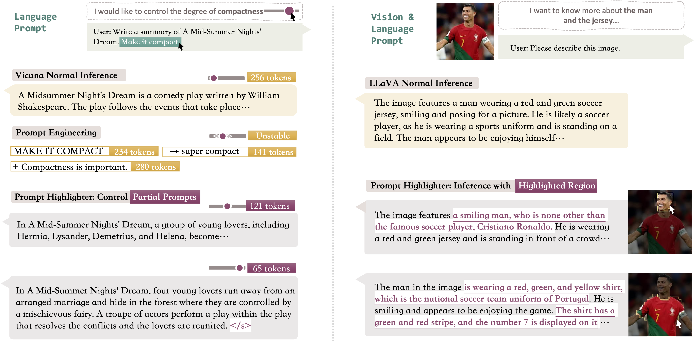
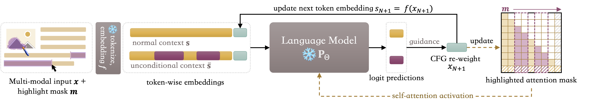

# Prompt Highlighter: Interactive Control for Multi-Modal LLMs


<p align="center">
<a href='https://julianjuaner.github.io/projects/PromptHighlighter/'></a>
<a href='https://arxiv.org/abs/2312.04302'></a>
</p>

Control text generation by highlighting your prompt! Prompt Highlighter is a training-free inference pipeline that facilitates token-level user interactions for a customized generation. Our method is compatible with both LLMs and VLMs.



## Overview

- [Prompt Highlighter: Interactive Control for Multi-Modal LLMs](#prompt-highlighter-interactive-control-for-multi-modal-llms)
  - [Overview](#overview)
  - [MileStones](#milestones)
  - [Quick Start](#quick-start)
    - [LLaVA](#llava)
    - [Vicuna (LLaMA-based LLMs)](#vicuna-llama-based-llms)
    - [InstructBLIP](#instructblip)
    - [InternLM-VLComposer](#internlm-vlcomposer)
  - [Method](#method)
  - [Cite Prompt Highlighter](#cite-prompt-highlighter)
  - [Acknowledgement](#acknowledgement)

## MileStones

* [X] `20231130` LLaMA attention modification & LLaVA descriptive task inference.
* [X] `20231130` Test data & mask upload.
* [X] `20231201` LLaVA highlighter benchmark test inference (MMBench & MME)
* [X] `20231201` LLaVA partial highlight inference
* [X] `20231202` Vicuna (LLM) partial highlight inference
* [X] `20231202` InstructBLIP partial highlight inference
* [ ] `20231204` Current Code Release!
* [ ] `TBD` InternLM-VLComposer benchmark test inference

## Quick Start

Basic enviornment setup:

```zsh
conda create -n highlighter python=3.10 -y
conda activate highlighter
pip install -r requirements.txt
```

### LLaVA

Install latest LLaVA model `2023-11-30` in base_models. If you already have one, you can use the installed one in your own enviornment.

```bash
# you may also use your installed llava if you have installed.
cd base_models
git clone https://github.com/haotian-liu/LLaVA.git
cd LLaVA

pip install --upgrade pip  # enable PEP 660 support
pip install -e .
```

**Model Download**: Please refer to [LLaVAv1.5 Model Zoo](https://github.com/haotian-liu/LLaVA/blob/main/docs/MODEL_ZOO.md) to get the base pretrained model.

**Partial Highlighting task**: We provide examples in `assets/test_data/questions_descriptions.json`, you may add your new case to test our method.

```bash
python examples/llava_test.py
```

**Descriptive task** (highlighting all input contexts): We provide examples in `assets/test_data/questions_descriptions.json`, you may add your new case to test our method.

```bash
python examples/llava_descriptions.py
```

We will also provide a scripte for descriptive COCO caption generation (TODO here).

If you want to add your customized data, please provide a squared image that use a darker (uint color < 128) marked region as the ***highlighter area***. And add your case in the json file.

**Benchmark Test**: Please refer to [evaluation data](https://github.com/haotian-liu/LLaVA/blob/main/docs/Evaluation.md#mme) to get your benchmark dataset (MMBench & MME). Benchmark result:

| Method                   | MME-perception | MMBench-dev | MMBench-test |
| :----------------------- | :------------: | :---------: | :----------: |
| baseline (LLaVAv1.5-13B) |     1531.3     |    67.7    |     67.0     |
| Ours                     |     1552.5     |    69.7    |     69.5     |

For MMBench, you may change your hyper-params in the following script and run:

```bash
# gamma (guidance strength)=1.3, 
# beta (attention weight)=3.0, 
# alpha (perturb weight) = 0.01, default test on the dev split.
bash examples/eval_scripts/mmbench_hl.sh 1.3 3.0 0.01
```

For MME:

```bash
# gamma (guidance strength)=1.3, 
# beta (attention weight)=2.0, 
# alpha (perturb weight) = 0.01
bash examples/eval_scripts/mme_hl.sh 1.3 2.0 0.01
```

You may found evaluated metric at `base_models/LLaVA/playground/data/eval/MME/eval_tool/answers/llava-v1.5-13b-hl-1.3-2.0-0.01/eval.log`

### Vicuna (LLaMA-based LLMs)

We provide a script to test the partial highlighter of the pure language input.
Download the vicuna model, we use the version [Vicuna-13B-v1.1](https://huggingface.co/lmsys/vicuna-13b-v1.1). You may change to any llama-based LLMs. In this case, you will need to change the conversation prompt template as well.
Please follow the instruction to - [install the LLaVA in the base_model](#LLaVA). If you already installed the LLaVA, you may directly test with the script:

```bash
python examples/llama_test.py \
    --txt "Please write a summary of A Mid-Summer Nights' Dream, make it compact." \
    --hl "make it compact."
```

Here you may change your input prompt and hlighted segments by passing `--txt` and `--hl`, respectively. If you want to pass multiple highlighted segments, you may use a `<s>` to split them. For example, you can pass `--hl "write a summary<s>make it compact."` to highlight multiple requirements.

### InstructBLIP

Install latest LAVIS `2023-11-30` in base_models. If you already have one, you can use the installed one in your own enviornment.

To run the InstructBLIP-Vicuna, you need to add the llm path (vicuna-13b v1.1) to the key  `llm_model` in the configuration file `base_models/LAVIS/lavis/configs/models/blip2/blip2_instruct_vicuna13b.yaml`.

```bash
# Please install with your highlighter env activated.
cd base_models
git clone https://github.com/salesforce/LAVIS.git
cd LAVIS
pip install -e .
```

**Partial Highlighting task**: Run examples  in `assets/test_data/questions_descriptions.json`, you may add your new case to test our method.

*Note*: Here we only implement a highlighting mechanism in the QFormer. We may update a hybrid highlighting (visual & text token) version in the future.

```python
python examples/instructblip_test.py
```

### InternLM-VLComposer

TBD.

## Method

<p align="center">
    <!-- pypi-strip -->
    <picture>
    <source media="(prefers-color-scheme: dark)" srcset="assets/pipeline_dark.png">
    <source media="(prefers-color-scheme: light)" srcset="assets/pipeline.png">
    <!-- /pypi-strip -->
    
    <!-- pypi-strip -->
    </picture><br>
    <!-- /pypi-strip -->
</p>

An abstract pipeline of Prompt Highlighter. Users can control the focus of generation by marking out specific image regions or text spans. Then a token-level mask $\mathbf{m}$ is created to guide the language model's inference. Motivated by the classifier-free diffusion guidance, we form regular and unconditional context pairs based on highlighted tokens, demonstrating that the autoregressive generation in models can be guided in a classifier-free way. Notably, we find that, during inference, guiding the models with highlighted tokens through the attention weights leads to more desired outputs.

## Cite Prompt Highlighter

If you find this repo useful for your research, please consider citing the paper

```
@article{zhang2023prompt,
      title={Prompt Highlighter: Interactive Control for Multi-Modal LLMs}, 
      author={Yuechen Zhang and Shengju Qian and Bohao Peng and Shu Liu and Jiaya Jia},
      year={2023},
      journal={arXiv preprint 2312.04302},
}
```

## Acknowledgement

We would like to thank the following repos for their great work:

- This work utilizes multi-modal LLMs with base models in [LLaVA](https://github.com/haotian-liu/LLaVA), [Vicuna](https://github.com/lm-sys/FastChat), [InstructBLIP](https://github.com/salesforce/LAVIS), and [InternLM-VLComposer](https://github.com/InternLM/InternLM-XComposer).
- This work utilizes the logit processor referenced in [CFG-LLM](https://github.com/huggingface/transformers/issues/24536).
- Part of the logo at the top of this page is generated with [Bing Image Creator](http://bing.com/images/create).
